<h1> İki Boyutlu(2D) Mono Kalibrasyon Uygulaması </h1>

<h2><b><i> Uygulamanın teorik adımlar da dahil, yapım aşamasındaki tüm adımlarına  <a href="https://github.com/aliyevorkhan/GORUNTU-ISLEME-MONO-KALIBRASYON-2D/blob/master/dokuman.pdf">DÖKÜMAN</a> üzerinden erişebilirsiniz</i></b></h2>

<h3> Uygulamanın kullanım akışı çıktıları aşağıdaki gibidir: </h3>

<h4> Çevrimiçi Kalibrasyon işlemleri </h4>
<ol>
  <li>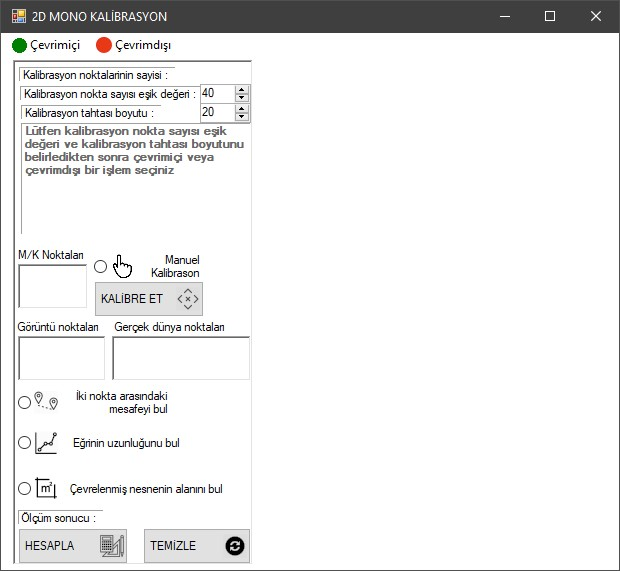</li>
  <li>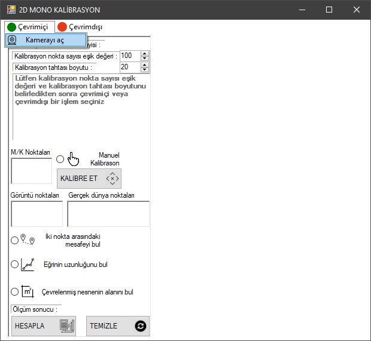</li>
  <li>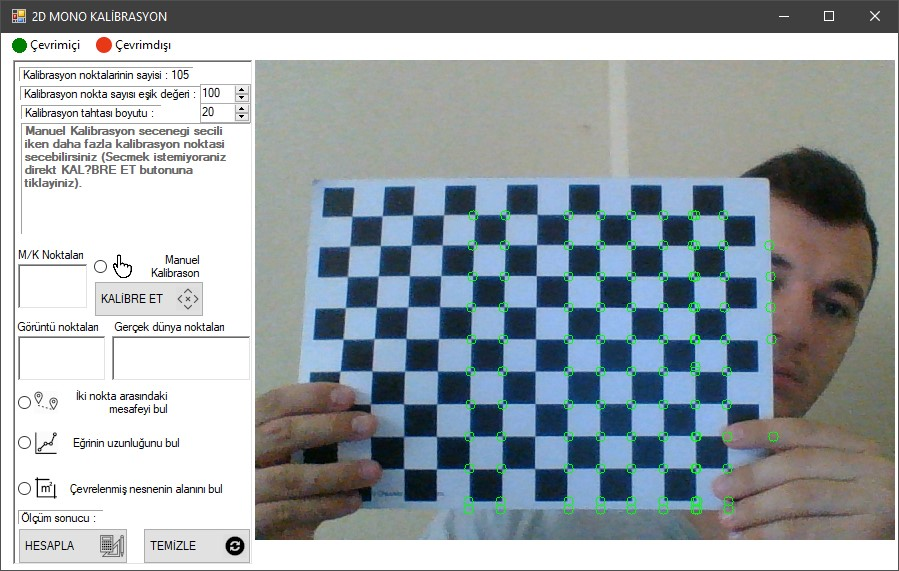</li>
  <li>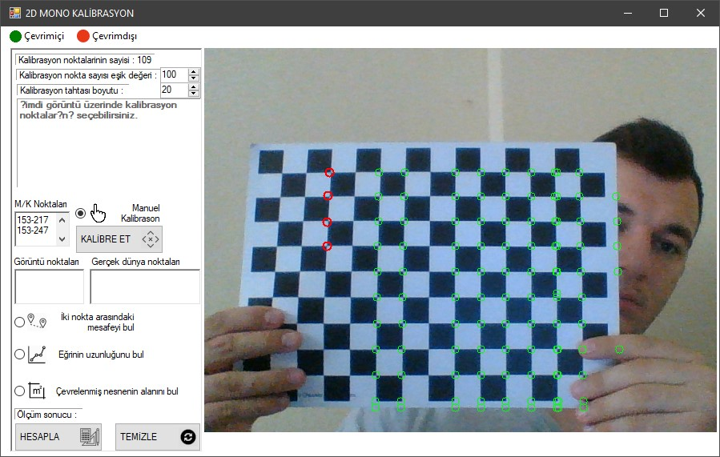</li>
  <li>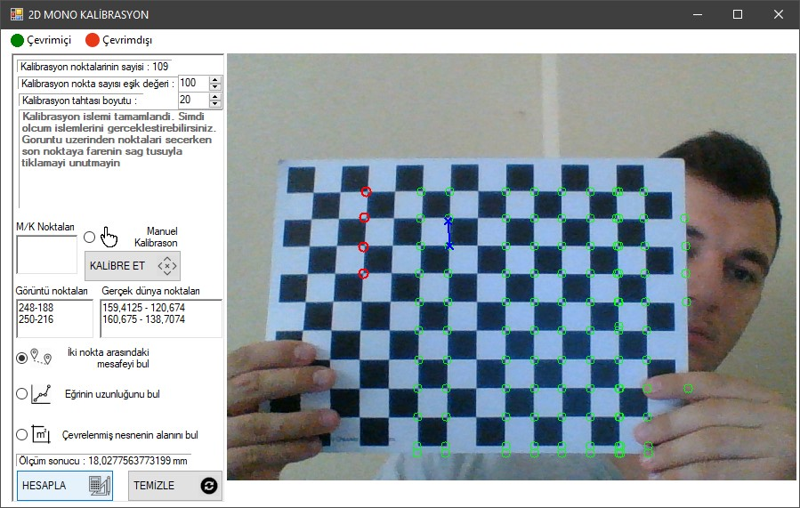</li>
  <li></li>
  <li></li>
  <li>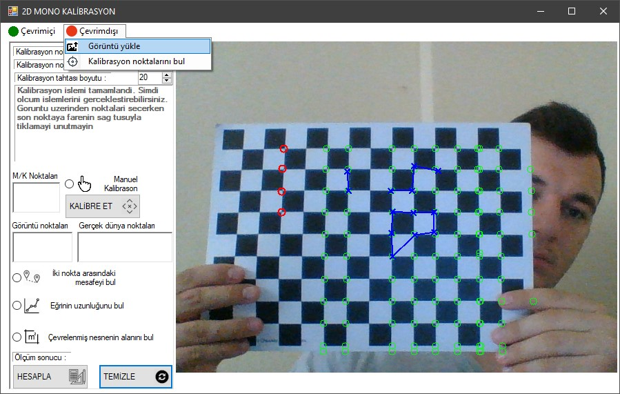</li>
</ol> 

<h4> Çevrimdışı Kalibrasyon işlemleri </h4>

<ol>
  <li>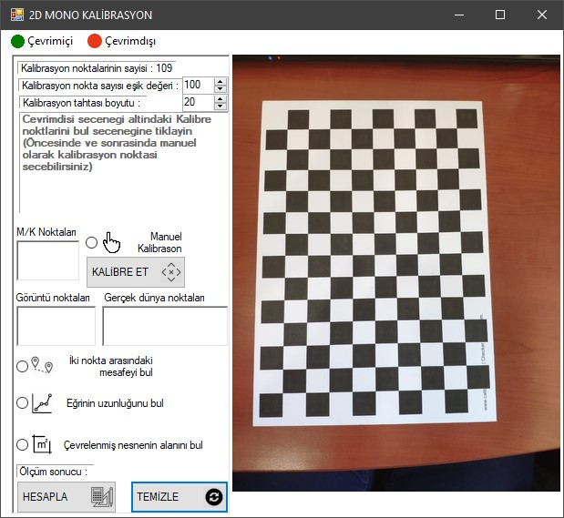</li>
  <li>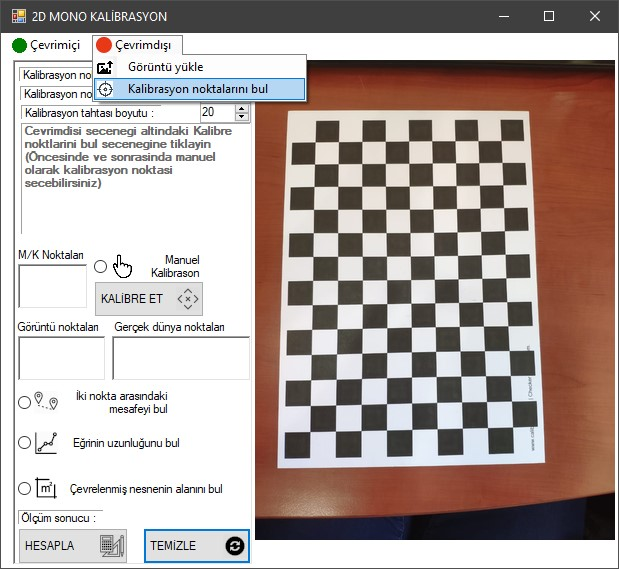</li>
  <li>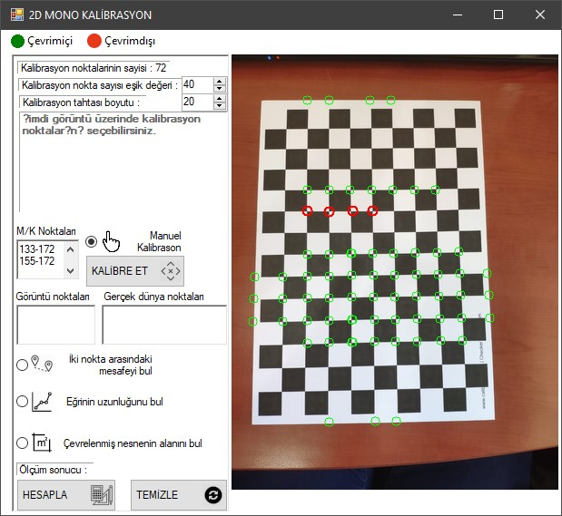</li>
  <li>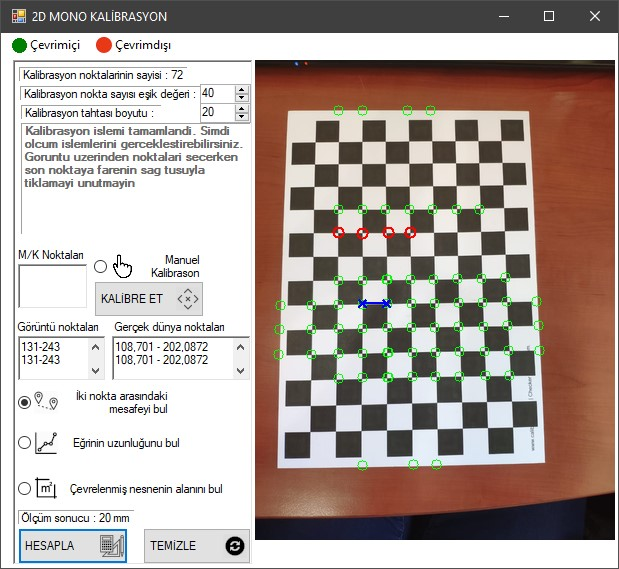</li>
  <li>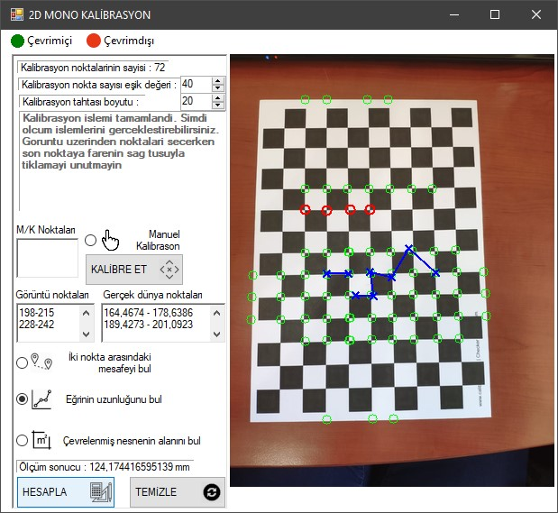</li>
  <li>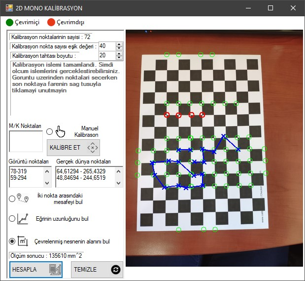</li>
</ol> 
